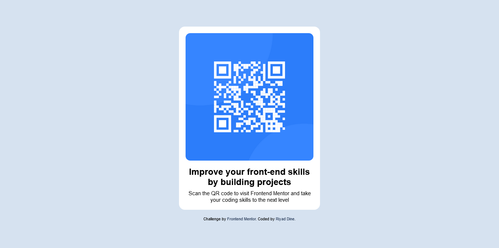

# Frontend Mentor - QR code component solution

This is a solution to the [QR code component challenge on Frontend Mentor](https://www.frontendmentor.io/challenges/qr-code-component-iux_sIO_H). Frontend Mentor challenges help you improve your coding skills by building realistic projects. 

## Table of contents

- [Frontend Mentor - QR code component solution](#frontend-mentor---qr-code-component-solution)
  - [Table of contents](#table-of-contents)
  - [Overview](#overview)
    - [Screenshot](#screenshot)
    - [Built with](#built-with)
  - [Author](#author)

## Overview

This project showcases a QR code component along with information about improving front-end skills.

### Screenshot

### Built with

- Semantic HTML5 markup
- CSS custom properties
- Flex box
- Mobile-first workflow

## Author

- Frontend Mentor - [@riyadDine](https://www.frontendmentor.io/profile/riyadDine)
